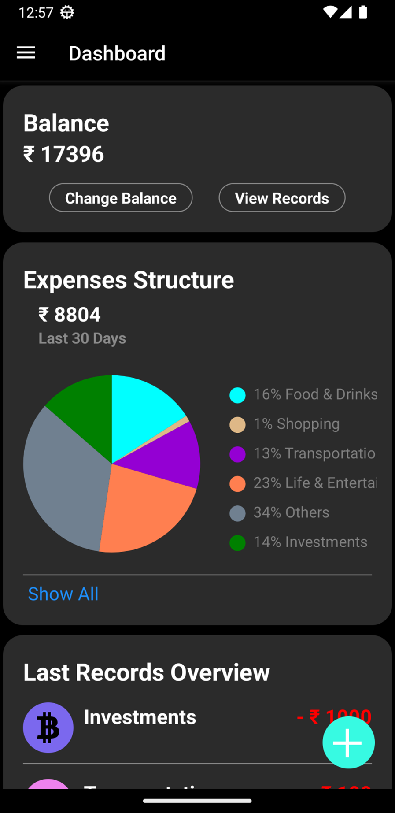
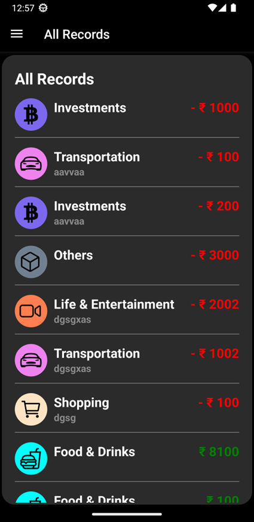
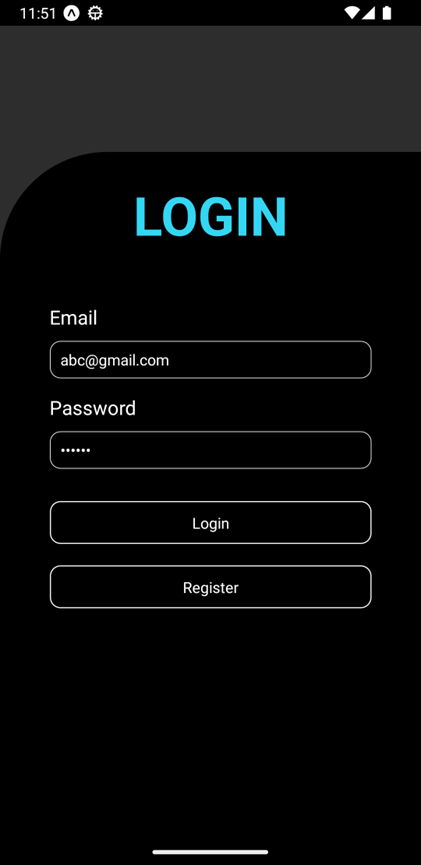
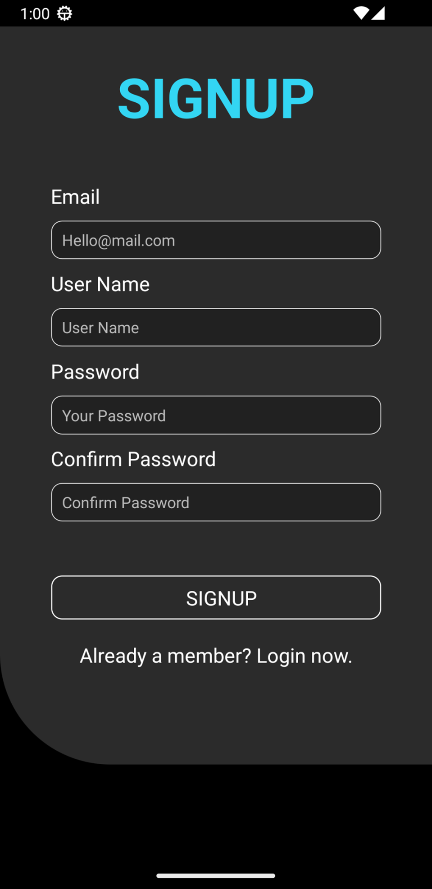
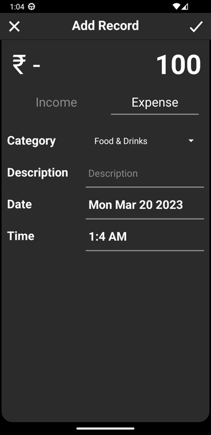

# SmartWallet

&#x20;

A **user-friendly** and **ad-free** mobile application built with **React Native** and **Firebase**, designed to help users track, categorize, and visualize their daily expenses on the go.

---

## Table of Contents

1. [Demo](#demo)
2. [Features](#features)
3. [Technologies Used](#technologies-used)
4. [Getting Started](#getting-started)

   * [Prerequisites](#prerequisites)
   * [Installation](#installation)
   * [Firebase Setup](#firebase-setup)
5. [Usage](#usage)
6. [Project Structure](#project-structure)
7. [Contributing](#contributing)
8. [License](#license)
9. [Contact](#contact)

---

## Demo

<p align="center">
  
  
  
  
  
</p>

> View more screenshots and download APKs in the [Releases](https://github.com/Shubham-860/SmartWallet/releases) section.

---

## Features

* **Expense Tracking**: Add, edit, and delete daily transactions in just a few taps.
* **Categorization**: Assign custom or predefined categories to each transaction.
* **Analytics & Graphs**: Visualize spending patterns over time with interactive charts.
* **Secure Storage**: User authentication and real-time data storage powered by Firebase.
* **Ad-Free Experience**: No ads or pop-ups for a clean UI and smooth workflow.

---

## Technologies Used

* **Frontend**: React Native, Expo
* **Backend**: Firebase Authentication, Cloud Firestore
* **Development**: JavaScript (ES6+), React Hooks
* **Tools & Services**: Expo CLI, Firebase Console, WebStorm (optional)

---

## Getting Started

Follow these steps to get a local copy up and running.

### Prerequisites

* [Node.js](https://nodejs.org/) >= 14
* [Expo CLI](https://docs.expo.dev/) >= 47
* A Firebase project (free tier available)

### Installation

```bash
# 1. Clone the repo
$ git clone https://github.com/Shubham-860/SmartWallet.git
$ cd SmartWallet

# 2. Install dependencies
$ npm install

# 3. Start Expo
$ npm start
```

This will launch the Expo DevTools in your browser. Scan the QR code with your Expo Go app (iOS/Android) or launch an emulator.

### Firebase Setup

1. Go to [Firebase Console](https://console.firebase.google.com/) and create a new project.

2. Enable **Authentication** (Email/Password) and **Cloud Firestore** in your project settings.

3. In your Firebase project settings, under **General > Your apps**, register a new **Web** app and copy the configuration.

4. Create a new file `/firebase.js` in the root of the project and paste:

   ```js
   // firebase.js
   import { initializeApp } from 'firebase/app';
   import { getAuth } from 'firebase/auth';
   import { getFirestore } from 'firebase/firestore';

   const firebaseConfig = {
     apiKey: "YOUR_API_KEY",
     authDomain: "YOUR_AUTH_DOMAIN",
     projectId: "YOUR_PROJECT_ID",
     storageBucket: "YOUR_STORAGE_BUCKET",
     messagingSenderId: "YOUR_MESSAGING_SENDER_ID",
     appId: "YOUR_APP_ID"
   };

   // Initialize Firebase
   const app = initializeApp(firebaseConfig);
   export const auth = getAuth(app);
   export const db = getFirestore(app);
   ```

5. Replace the placeholder values with your Firebase config.

---

## Usage

1. **Register** or **Log In** with your email and password.
2. On the **Home** screen, tap **Add Transaction** to record a new expense.
3. Use **Categories** to filter or customize transaction types.
4. Navigate to the **Analytics** tab to view spending charts and trends.

---

## Project Structure

```text
SmartWallet/
├── assets/           # Images, icons, and static assets
├── Components/       # Reusable React Native components
├── firebase.js       # Firebase configuration and exports
├── App.js            # Entry point for the app
├── app.json          # Expo configuration
├── babel.config.js   # Babel presets
└── package.json      # Project dependencies
```

---

## Contributing

Contributions are welcome! To get started:

1. Fork the repository
2. Create your feature branch (`git checkout -b feature/AmazingFeature`)
3. Commit your changes (`git commit -m 'Add some AmazingFeature'`)
4. Push to the branch (`git push origin feature/AmazingFeature`)
5. Open a Pull Request

Please ensure your code follows the existing style and passes all linting checks.

---

## License

Distributed under the MIT License. See [LICENSE](LICENSE) for more information.

---

## Contact

Shubham Sharad Salunkhe - [LinkedIn](https://www.linkedin.com/in/shubham-sharad-salunkhe) - [shubham@example.com](mailto:shubham@example.com)

Project Link: [https://github.com/Shubham-860/SmartWallet](https://github.com/Shubham-860/SmartWallet)
